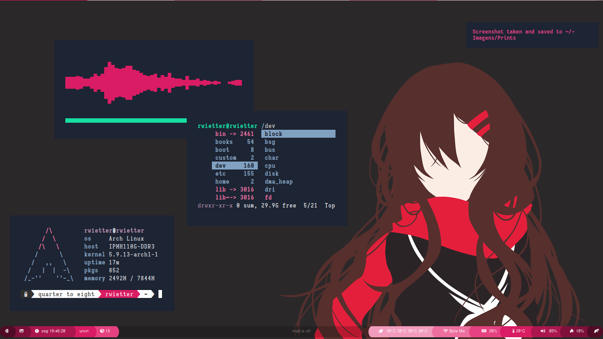

 

  

    
    <h3>Description</h3>
    
This my Arch Linux System dotsfiles

    <h3>Setup</h3>
    <ul>
      <li><strong>WM</strong>: bspwm</li>
      <li><strong>Bar</strong>: polybar</li>
      <li><strong>Hotkey</strong>: sxhkd</li>
      <li><strong>Browser</strong>: brave</li>
      <li><strong>Text Editor</strong>: Code</li>
      <li><strong>Music</strong>: mpd</li>
      <li><strong>Music Visualizer</strong>: ncmpcpp</li>
      <li><strong>Terminal</strong>: urxvt</li>
      <li><strong>Compositor</strong>: picom</li>
    </ul>

 
 

<h3>SETUP</h3> 

| `Description`         | `Packages`            |
| --------------------- | --------------------- |
| Window Manager        | bspwm                 |
| Bar                   | polybar               |
| File Manager          | nautilus              |
| Browser               | brave                 |
| Text Editor           | code                  |
| Music                 | mpd - ncmpcpp - fmui  |
| Menu Launcher         | rofi                  |
| Terminal              | rxvt-unicode          |
| Compositor            | picom                 |
| IDE                   | code                  |
| Screen Capture        | scrot and maim        |
| SHELL                 | zsh                   |
